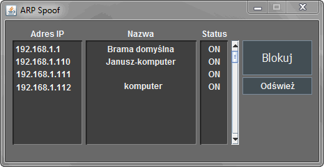

# ARP
An application that allows you to disable Internet access for a specific user in the home network.

For this purpose, it performs an ARP Spoofing.

## What is ARP Spoofing
The attack carried out with this method consists in sending ARP packets containing fake MAC addresses in the LAN network.
This attack allows an attacker to block victim internet connection or to capture data on a local network.
Its operation consists in sending properly crafted ARP frames causing any traffic meant for victim to be sent to the attacker.

This attack can only by used when the network use dynamic ARP.

Also, an attacker need to by connected in his victim network.
You can't perform this attack on a person connected to a different network than you are connected to.

## How it works
When we start the app it creates a list of devices now connected to local network.
In this purpose the app is searching IP addresses wrote in ARP table stored in a computer.
The addresses are browsed to found only another devices addresses. For example broadcast,
localhost or gateway addresses are rejected.

By looking on ARP table we also have a MAC addresses needed to send a fake Ethernet frame.

This finded IP addresses are showing in program. The next step is to have all found the host name.
This allows us to block a selected user by his name which is easier to found a victim than to look by IP address.
Of course this IP address is showed, so we can still use it in this purpose.

Now we can select a victim and click "**Blokuj**" button to start poisoning your router ARP cache.

OK, in this point we have IP and MAC addresses of victim, gateway and your own.
Now we will prepare a spoofed ARP messages by using this data.
Now, when we have all ready, the program create a thread to send ARP frames into our local network.
The victim loses his internet connection and you can now block another device.

To stop blocking simply the device and click "**Blokuj**" button again.

To refresh list of devices just click "**Odśwież**" button.

This application works only on Windows OS. The reason is that I am using windows command line and I have not prepared a version for different systems yet.

This application has a polish language interface.

## External libraries
[jnetpcap](https://github.com/ruedigergad/clj-net-pcap/tree/master/jnetpcap) - to create ARP frame and sending it
